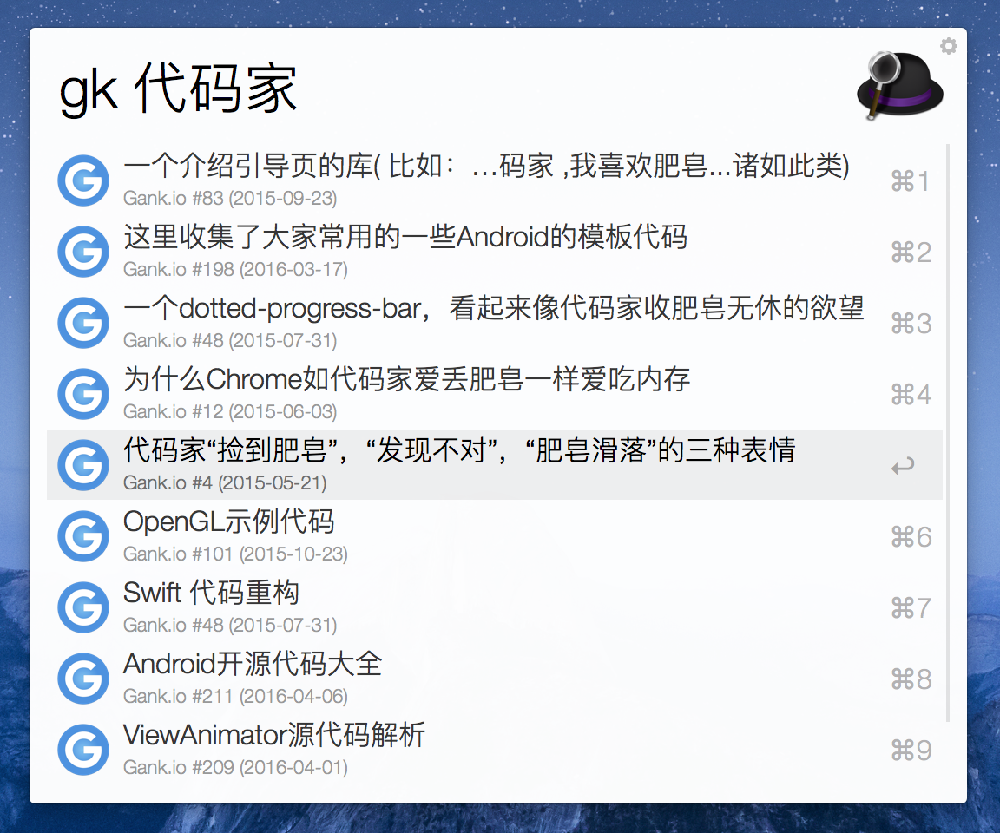
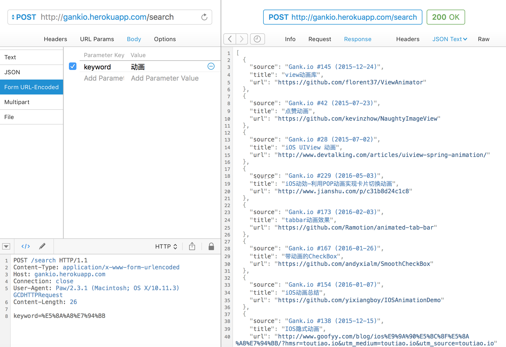
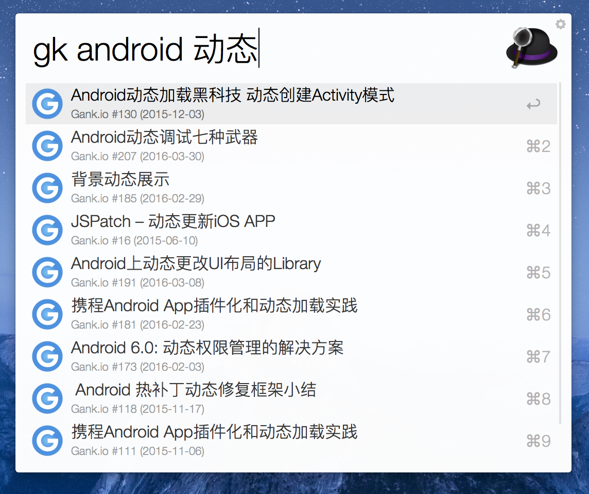

# Gank Alfred Workflow
>  The missing Alfred Workflow for searching ganks(干货) in gank.io

干货搜索器，一个自制的Alfred Workflow，功能是搜索[gank.io](http://gank.io)中的干货！

#### 0.使用方式

[下载最新版本的workflow文件双击使用Alfred打开即可](https://github.com/hujiaweibujidao/Gank-Alfred-Workflow/releases)，**使用前提是Alfred Workflow开启了Powerpack功能。**

搜索操作的触发词是`gk` （short for `gank`）



#### 1.项目起因

[gank.io](http://gank.io)网站上的搜索是根据搜索关键词在各期的干货日报中的出现情况进行搜索的，得到的搜索结果也是包含搜索关键词的日报，而不是具体的干货。加之不少推荐的干货的描述并没有简要地概括其干货内容，导致很多干货很难搜索到。此外，目前的搜索功能不支持多个搜索词的组合搜索，比如搜索`ios 动画`会得到很多结果，而搜索`动画`得到的结果只有几个。（好了，不说了，不然[@代码家](https://github.com/daimajia)要直接干我了 😭）

 

项目的真实起因其实是自己马上就要毕业参加工作了，深知自己很多东西都不会，所以想要看些干货提高自己，但是却又找不到干货在哪里 🙈🙈🙈

#### 2.改进方案

两个可供改进的点：

（1）搜索结果应该直接显示与搜索关键词相关的干货列表

（2）搜索过程应该考虑干货目标网页的内容

#### 3.实现原理

只通过一个Alfred Workflow要想解决这么多问题是比较困难的，Alfred Workflow只是调用我开发的另一个项目[Ganks for gank.io](https://github.com/hujiaweibujidao/Ganks-for-gank.io)部署在Heroku平台的搜索接口，并将搜索结果显示给开发者。所以，整个项目主要分成两部分：

##### （1）[Ganks for gank.io](https://github.com/hujiaweibujidao/Ganks-for-gank.io)

**这个项目主要是利用[Gank的API](http://gank.io/api)来获取干货列表，除此之外，该项目还利用[dragnet](https://github.com/seomoz/dragnet)开源工具提取每一个干货的目标网页内容，最终利用[Lucene](http://lucene.apache.org/)和[Spark](http://sparkjava.com/)等开源工具提供一个高效的干货搜索接口，并将其部署在[Heroku](https://www.heroku.com/)平台。**   [网站预览](http://gankio.herokuapp.com/) 

有了dragnet和lucene等开源工具搜索就好办多了，更多详情请查看项目[Ganks for gank.io](https://github.com/hujiaweibujidao/Ganks-for-gank.io) 


网站[http://gankio.herokuapp.com/](http://gankio.herokuapp.com/)提供的搜索接口如下图所示，发送post请求到`http://gankio.herokuapp.com/search`，请求体放参数为`keyword`的搜索关键词即可。



**任何工具都可以测试该接口，只是目前我的Heroku账号处于free plan，所以应用每24个小时会有几个小时处于停止状态，所以祝你好运！** 🙈🙈🙈

##### （2）Gank Alfred Workflow

有了后台搜索接口之后Alfred Workflow就好写了，这里使用的是被广泛使用的Python库[deanishe/alfred-workflow](https://github.com/deanishe/alfred-workflow/)，它对workflow的很多功能和操作进行了封装，例如预处理使用者输入的数据、请求数据的缓存、workflow的更新等，作者担心我们不会用，还特意写了份很好的[入门教程](http://www.deanishe.net/alfred-workflow/tutorial.html)方便开发者迅速上手。

**Gank Alfred Workflow的功能是返回前10条与使用者输入的搜索关键词相关的干货，快捷键操作将会使用默认的浏览器打开对应干货的网址。**嗯，是的，仅此而已，但是其实你如果觉得有必要还可以加上默认显示最新一期的干货数据、或者自定义各种搜索方式来玩转[gank.io](http://gank.io/api)提供的API都行。

#### 4.界面截图




#### 5.开发后记

很显然，如果我们的后台有更多的干货的话，就能不断增强这个Alfred Workflow的搜索体验（这还不是为了远离百毒嘛😓）。这个相关的开发也是我目前还在做的另一个项目[GankHub]()，从名字中可以看出这是要做一个增强版的`干货集中营`，其中的数据既包含了[gank.io](http://gank.io)中的数据，还包含了Android开发周报中的干货数据，这正是我的另一个项目[Ganks-for-andoirdweekly.net](https://github.com/hujiaweibujidao/Ganks-for-andoirdweekly.net)做的事情。还有一个棘手的问题是，**如何及时处理后台干货数据的更新？** Heroku的定时任务要收费！

#### The license

```
The MIT License (MIT)

Copyright (c) 2016 Hujiawei

Permission is hereby granted, free of charge, to any person obtaining a copy
of this software and associated documentation files (the "Software"), to deal
in the Software without restriction, including without limitation the rights
to use, copy, modify, merge, publish, distribute, sublicense, and/or sell
copies of the Software, and to permit persons to whom the Software is
furnished to do so, subject to the following conditions:

The above copyright notice and this permission notice shall be included in all
copies or substantial portions of the Software.

THE SOFTWARE IS PROVIDED "AS IS", WITHOUT WARRANTY OF ANY KIND, EXPRESS OR
IMPLIED, INCLUDING BUT NOT LIMITED TO THE WARRANTIES OF MERCHANTABILITY,
FITNESS FOR A PARTICULAR PURPOSE AND NONINFRINGEMENT. IN NO EVENT SHALL THE
AUTHORS OR COPYRIGHT HOLDERS BE LIABLE FOR ANY CLAIM, DAMAGES OR OTHER
LIABILITY, WHETHER IN AN ACTION OF CONTRACT, TORT OR OTHERWISE, ARISING FROM,
OUT OF OR IN CONNECTION WITH THE SOFTWARE OR THE USE OR OTHER DEALINGS IN THE
SOFTWARE.
```


