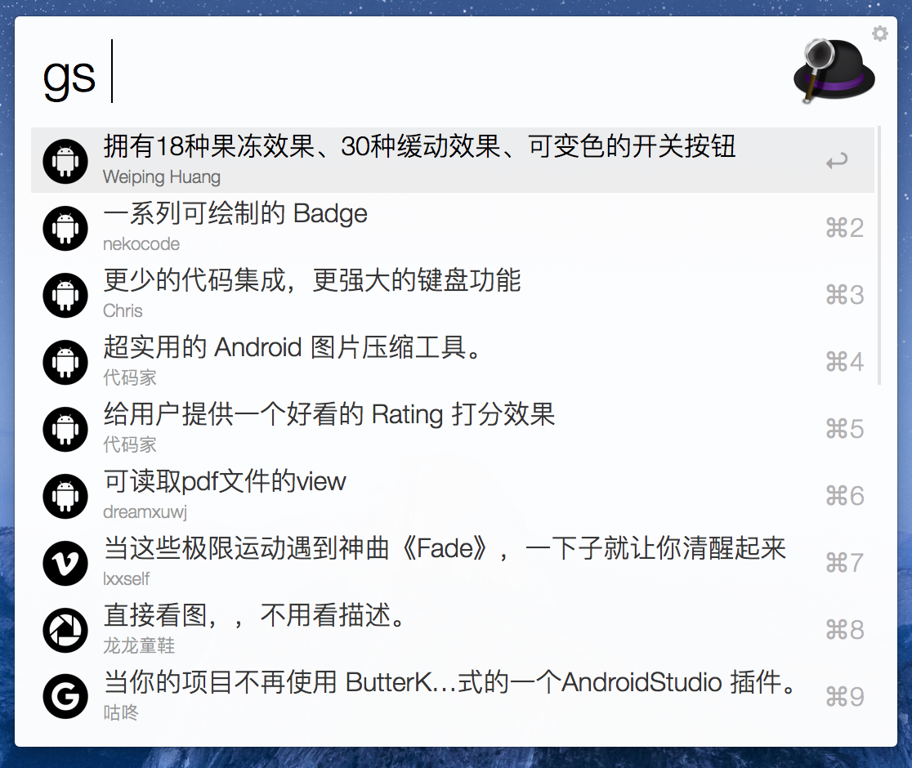

# Gank Alfred Workflow

>  The missing Alfred Workflow for searching ganks(干货) in gank.io

干货搜索器，一个自制的Alfred Workflow，功能是搜索[gank.io](http://gank.io)中的干货！

这是干货搜索器的第二个版本V2，因为[@代码家](https://github.com/daimajia)提供了官方的干货搜索接口咯！

官方的干货搜索接口真是碾压一切啊！用起来相当方便，搜索结果也是非常丰富！

#### 使用方式

[下载最新版本的workflow文件双击使用Alfred打开即可](https://github.com/hujiaweibujidao/Gank-Alfred-Workflow/releases)。  

**使用前提是Alfred Workflow开启了Powerpack功能。**

搜索操作的触发词是`gs` （short for `gank search`）


有了后台搜索接口之后Alfred Workflow就好写了，这里使用的是Python库[deanishe/alfred-workflow](https://github.com/deanishe/alfred-workflow/)，它对workflow的很多功能和操作进行了封装，例如预处理使用者输入的数据、请求数据的缓存、workflow的更新等，作者担心我们不会用，还特意写了份很好的[入门教程](http://www.deanishe.net/alfred-workflow/tutorial.html)方便开发者迅速上手。

**Gank Alfred Workflow的主要功能是返回前50条与输入的搜索关键词相关的干货列表数据（该数据缓存时间是10分钟），点击Enter将会使用默认的浏览器打开对应干货的网址。此外，如果用户没有提供任何搜索关键词的话会默认显示今天的干货数据（该数据缓存时间是1分钟）。不同类型的干货前面的小图标是不同的，此外，每条干货下面都会显示对应的推荐者哟。** 



如果你对我的开发工作感兴趣的话记得在Github上Follow我哟，或者关注[我的博客](http://hujiaweibujidao.github.io/)。

#### The license

```
The MIT License (MIT)

Copyright (c) 2016 Hujiawei

Permission is hereby granted, free of charge, to any person obtaining a copy
of this software and associated documentation files (the "Software"), to deal
in the Software without restriction, including without limitation the rights
to use, copy, modify, merge, publish, distribute, sublicense, and/or sell
copies of the Software, and to permit persons to whom the Software is
furnished to do so, subject to the following conditions:

The above copyright notice and this permission notice shall be included in all
copies or substantial portions of the Software.

THE SOFTWARE IS PROVIDED "AS IS", WITHOUT WARRANTY OF ANY KIND, EXPRESS OR
IMPLIED, INCLUDING BUT NOT LIMITED TO THE WARRANTIES OF MERCHANTABILITY,
FITNESS FOR A PARTICULAR PURPOSE AND NONINFRINGEMENT. IN NO EVENT SHALL THE
AUTHORS OR COPYRIGHT HOLDERS BE LIABLE FOR ANY CLAIM, DAMAGES OR OTHER
LIABILITY, WHETHER IN AN ACTION OF CONTRACT, TORT OR OTHERWISE, ARISING FROM,
OUT OF OR IN CONNECTION WITH THE SOFTWARE OR THE USE OR OTHER DEALINGS IN THE
SOFTWARE.
```


